# MATIS _Multi-level Asynchrounous Tools Interconnection System_

Fast complex asynchrounous processes made easy.

----




## Example

```text
                           |
                           | path
                      +----------+
                      | loadBody |
                      +----------+
                    path |    | text
                         |    |
                 +-------+--( | )----------+
                 |            |            |
            path |            |            | path
        +------------------+  |  +------------------+
        | changeExtForHead |  |  | changeExtForFoot |
        +------------------+  |  +------------------+
        path |                |              | path
             |                |              |
        path |                |              | path
       +------------+         |         +------------+
       | existsHead |         |         | existsFoot |
       +------------+         |         +------------+
       no |       | yes       |       yes |       | no
          |       |           |           |       |
     void |       | path      |      path |       | void
+-----------+   +----------+  |  +----------+   +-----------+
| constHead |   | loadHead |  |  | loadHead |   | constHead |
+-----------+   +----------+  |  +----------+   +-----------+
     text |       | text      |      text |       | text
          |       |           |           |       |
          +---+---+           |           +---+---+
              |               |               |
              +------------+  |  +------------+
                           |  |  |
                           | b|  | 
                           | o|  |
                           | d|  |
                      head | y|  | foot
                         +--------+
                         | concat |
                         +--------+
                             | text
                             |
```


```js
var Matis = require("async-tools");

// Create tools.
var loadBody = Matis.tools.LoadText('utf-8');
var loadHead = Matis.tools.LoadText('utf-8');
var loadFoot = Matis.tools.LoadText('utf-8');
var changeExtForHead = Matis.tools.ChangeExtension({js: "head"});
var changeExtForFoot = Matis.tools.ChangeExtension({js: "foot"});
var existsHead = Matis.tools.ExistsFile();
var existsFoot = Matis.tools.ExistsFile();
var constHead = Matis.tools.Constant("// Missing header.\n");
var constFoot = Matis.tools.Constant("// Missing footer.\n");
var concat = Matis.tools.ConcatStrings(['head', 'body', 'foot']);

// Link tools.
loadBody.link('text', concat, 'body');
loadBody.link('path', changeExtForHead).link(existsHead).link('yes', loadHead).link('text', concat, 'head');
loadBody.link('path', changeExtForFoot).link(existsFoot).link('yes', loadFoot).link('text', concat, 'foot');
existsHead.link('no', constHead).link(concat, 'head');
existsFoot.link('no', constFoot).link(concat, 'foot');

// Execute.
loadBody.exec(
    { path: 'myfile.js' },
    function (output) {
        console.log("Result is: " + output.text);
    },
    function (err) {
        console.error("Error: " + err);
    }
);
```

## Build-in tools

While it's easy to write your own tools, we provide a list of generic build-in tools which can help you quickly prototype your processes.


<a name='ChangeExtension.js'></a>
### ChangeExtension.js


An extension is the string after the last occurence of a dot (`.`) in
a `path`.   This tool replaces  extensions with other one.   It never
fails: the `reject` function will never be called.

@param {object}  extensions -  Each attribute  name is  replaced with
it's  value. For  instance `{js:  'head'}` means  than the  extension
`.js`  must  be  replaced  with `.head`.  Other  files  names  remain
unchanged.


<a name='ConcatStrings.js'></a>
### ConcatStrings.js


Constants cas be used in many cases, such as default values.

* __argument__: the constant value this tool will always emit.
* __input__
    * {any} `void` - This input is just a trigger. It's value is ignored.
* __output__
    * {any} `value` - A constant value defined by the `value` argument.


<a name='ConsoleLog.js'></a>
### ConsoleLog.js


If  `path`  exists and  is  a  file, emit  it  on  the `yes`  output,
otherwise, emit it on the `no`.

* __input__
    * {string} path - Path of the file we want know if it exists.
* __output__
    * {string} yes - Path of the file if it exists.
    * {string} no - Path of the file if it does not exist.


<a name='Constant.js'></a>
### Constant.js


This tool is used for debug  purpose. The input is displayed with the
`console.log()` function, then sent to the output unchanged.


<a name='ExistsFile.js'></a>
### ExistsFile.js


Concat all the inputs in one output. 

@param {array[string]} inputs - Array inputs' names.

* __input__: Thisn tool has a variable number of inputs specified by the `inputs` argument.
* __output__
    * {string} `text` - The resulting concatenated string.


<a name='ForEach.js'></a>
### ForEach.js


* __argument__:
    * {array[string]} `input`: Array of inputs' names. The first one is the array over which we will loop.
    * {array[string]} `output`: Array of outputs' names. They all are arrays.
    * {Tool} `tool`:


<a name='Join.js'></a>
### Join.js


Join all elements of an array with a `glue`.

* __param__ 
    * {string} glue - Text to add between two elements of the `array`.
* __input__
    * {array[string]} `array` - Array of strings to join with the `glue`.
* __output__
    * {string} `text` - The resulting joined array..


<a name='LoadStream.js'></a>
### LoadStream.js


@param  {object|string}   options  -  As   a  string,  this   is  the
encoding. Otherwise, it  has the same meaning as the  argument in the
[`fs.readFile(filename[, options], callback)`](https://nodejs.org/dist/latest-v4.x/docs/api/fs.html#fs_fs_readfile_filename_options_callback) function.


<a name='LoadText.js'></a>
### LoadText.js


This tool is used for debug  purpose. The input is displayed with the
`console.log()` function, then sent to the output unchanged.


<a name='MatchRegexp.js'></a>
### MatchRegexp.js


@param  {object|string}   options  -  As   a  string,  this   is  the
encoding. Otherwise, it  has the same meaning as the  argument in the
[`fs.readFile(filename[, options], callback)`](https://nodejs.org/dist/latest-v4.x/docs/api/fs.html#fs_fs_readfile_filename_options_callback) function. Default is `utf8`.


<a name='ReadDir.js'></a>
### ReadDir.js


* Return an array of files' names contained in the folder `path`.
* 
* * __input__
*     * {string} `path` - Path from where to list existing files.
* * __output__
* * {array[string]} `files`  - Array of the  names of the files  in the
        directory excluding `'.'` and `'..'`.
